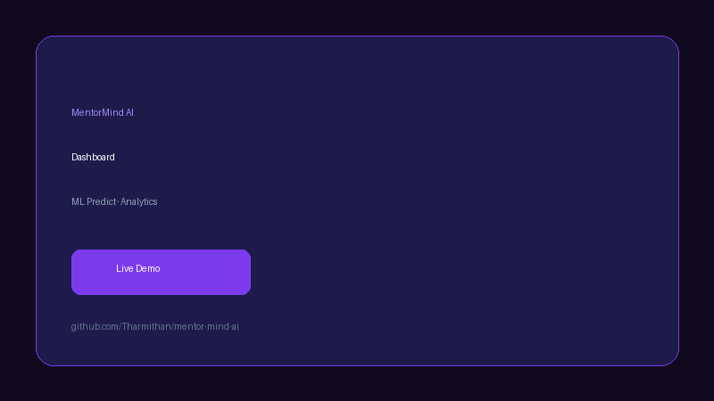

# MentorMind AI

**AI Personalized Learning & Interview Coach** — predict performance, study smarter, practice interviews, and chat with your own notes.

[](https://github.com/Tharmithan/mentor-mind-ai/actions/workflows/tests.yml)


<p align="center">
  
</p>

---

## Overview

MentorMind AI is a **production-quality full-stack platform** that combines machine learning, RAG, computer vision, and LLMs into one learning companion for students.

Students get **performance predictions** with SHAP explainability, **personalized study plans**, **RAG chat over their own PDFs**, **AI mock interviews** with speech and emotion analysis, **career guidance**, and an **AI Coach dashboard** with MLOps and monitoring.

Built over 8 weeks as a portfolio-grade project — deployed on **Vercel + Railway + Supabase** with JWT auth, pytest CI, and 70+ API endpoints.

**Repository:** [github.com/Tharmithan/mentor-mind-ai](https://github.com/Tharmithan/mentor-mind-ai)

---

## Features

| Feature | Description |
|---------|-------------|
| **ML Performance Prediction** | Random Forest / XGBoost models with risk & burnout detection |
| **SHAP Explainability** | Feature contributions for every prediction |
| **Study Recommendations** | Weak-topic detection, revision order, daily planner |
| **RAG Learning Assistant** | Upload PDFs → semantic search → grounded Q&A |
| **AI Mock Interview** | HR, technical, behavioral modes with scoring & feedback |
| **Speech & Emotion Analysis** | Whisper STT + webcam confidence/stress detection |
| **Multi-Agent System** | Study, Interview, Career, Resume agents |
| **AI Coach Dashboard** | Scores, skill gaps, personalization, memory, analytics |
| **MLOps Pipeline** | Model registry, MLflow experiments, promote to production |
| **Monitoring & Feedback** | Prediction logging, user ratings, drift metrics |
| **JWT Authentication** | Register, login, refresh tokens, rate limiting |

---

## Tech Stack

| Layer | Technologies |
|-------|--------------|
| **Frontend** | Next.js 16, TypeScript, Tailwind CSS, Recharts |
| **Backend** | FastAPI, Python 3.12, Uvicorn, SQLAlchemy async |
| **Database** | PostgreSQL (Supabase), SQLite (dev) |
| **Vector DB** | ChromaDB, Sentence Transformers |
| **ML** | Scikit-learn, XGBoost, SHAP, joblib |
| **LLM** | OpenAI-compatible API (optional) |
| **Interview** | Whisper, OpenCV, MediaPipe FER |
| **DevOps** | Docker, GitHub Actions, Vercel, Railway |
| **Testing** | pytest (24 tests — unit, integration, e2e) |

---

## Architecture

```
Frontend (Next.js)
        ↓
FastAPI Backend
        ↓
AI Services Layer  (Agents · RAG · Interview · MLOps)
        ↓
ML Models + Embeddings + LLM
        ↓
PostgreSQL + ChromaDB + File Stores
```

| Diagram | Location |
|---------|----------|
| System architecture | [architecture/system-architecture.mmd](architecture/system-architecture.mmd) |
| AI pipeline | [architecture/ai-pipeline.mmd](architecture/ai-pipeline.mmd) |
| Full write-up | [docs/architecture.md](docs/architecture.md) |

---

## Installation

### Prerequisites

- Node.js 18+
- Python 3.12+
- (Optional) PostgreSQL / [Supabase](https://supabase.com)
- (Optional) Docker

### Quick start

```bash
git clone https://github.com/Tharmithan/mentor-mind-ai.git
cd mentor-mind-ai

# Backend
cd backend && python -m venv .venv && source .venv/bin/activate
pip install -r requirements.txt && cp .env.example .env
uvicorn app.main:app --reload --port 8000

# Frontend (new terminal)
cd frontend && npm install && npm run dev
```

| Service | URL |
|---------|-----|
| App | http://localhost:3000 |
| API | http://localhost:8000 |
| OpenAPI | http://localhost:8000/docs |

### Run tests

```bash
./scripts/run-tests.sh
```

### Production deploy

See [docs/deployment-guide.md](docs/deployment-guide.md) and [docs/week8-day1-deployment.md](docs/week8-day1-deployment.md).

---

## Screenshots

### Dashboard — ML prediction & analytics


### AI Coach — career intelligence hub


### Assistant — RAG chat over your notes


### Interview Coach — mock interviews with feedback


> Replace SVG mockups with PNG captures — see [screenshots/README.md](screenshots/README.md).

---

## Demo Video

<!-- Replace YOUR_VIDEO_ID with your YouTube upload -->
<!-- [](https://youtu.be/YOUR_VIDEO_ID) -->

**Animated preview:** [demo/demo.gif](demo/demo.gif)

Record a full walkthrough and add your link above. Guide: [demo/README.md](demo/README.md).

---

## Project Structure

```
mentor-mind-ai/
├── frontend/          # Next.js app
├── backend/           # FastAPI API + tests
├── ml-models/         # Trained joblib artifacts
├── docs/              # Full documentation
├── screenshots/       # README UI previews
├── architecture/      # Mermaid diagrams
├── demo/              # Demo GIF + video guide
├── scripts/           # deploy, test, benchmark
└── .github/workflows/ # CI (pytest)
```

---

## Documentation

| Document | Description |
|----------|-------------|
| [Project Overview](docs/PROJECT.md) | Objectives, features, doc map |
| [API Reference](docs/api-reference.md) | REST endpoints + curl examples |
| [User Guide](docs/user-guide.md) | How students use the app |
| [Developer Guide](docs/developer-guide.md) | Contributor onboarding |
| [Database Schema](docs/database-schema.md) | Tables, ERD, ChromaDB |
| [Deployment Guide](docs/deployment-guide.md) | Local → cloud |
| [Docs Index](docs/README.md) | Complete documentation map |

---

## Future Work

- [x] JWT auth + user registration
- [x] Production deployment (Vercel + Railway + Supabase)
- [x] Automated test suite + CI
- [x] Performance optimization (caching, lazy loading)
- [ ] Multilingual support (English + Tamil)
- [ ] Mobile PWA
- [ ] pgvector migration (ChromaDB → Supabase)
- [ ] Team / classroom admin dashboards
- [ ] Full demo video on YouTube

---

## License

MIT — see [LICENSE](LICENSE).

---

## Contributors

Built by **Tharmithan** as a production-quality AI learning platform. Contributions welcome via pull requests.
