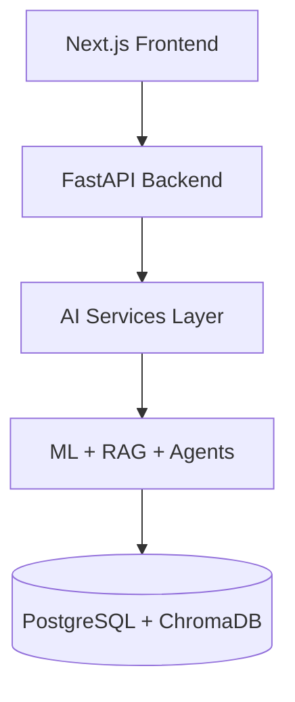

# Architecture Diagrams

Mermaid source files for the MentorMind AI system. GitHub renders `.md` files with Mermaid blocks; use these sources in docs or export to PNG for presentations.

| File | Description |
|------|-------------|
| [system-architecture.mmd](./system-architecture.mmd) | Full-stack layered architecture |
| [ai-pipeline.mmd](./ai-pipeline.mmd) | ML, RAG, interview, and recommendation flows |

## System architecture



See [system-architecture.mmd](./system-architecture.mmd) for the full diagram.

## AI pipeline

Covers prediction, RAG document chat, mock interviews, and study recommendations.

See [ai-pipeline.mmd](./ai-pipeline.mmd) for the full diagram.

## Related docs

- [docs/architecture.md](../docs/architecture.md) — narrative architecture guide
- [docs/diagrams/](../docs/diagrams/) — canonical copies used in Week 7/8 docs

## Export to PNG (optional)

```bash
# Using mermaid-cli (npm i -g @mermaid-js/mermaid-cli)
mmdc -i architecture/system-architecture.mmd -o architecture/system-architecture.png
mmdc -i architecture/ai-pipeline.mmd -o architecture/ai-pipeline.png
```
