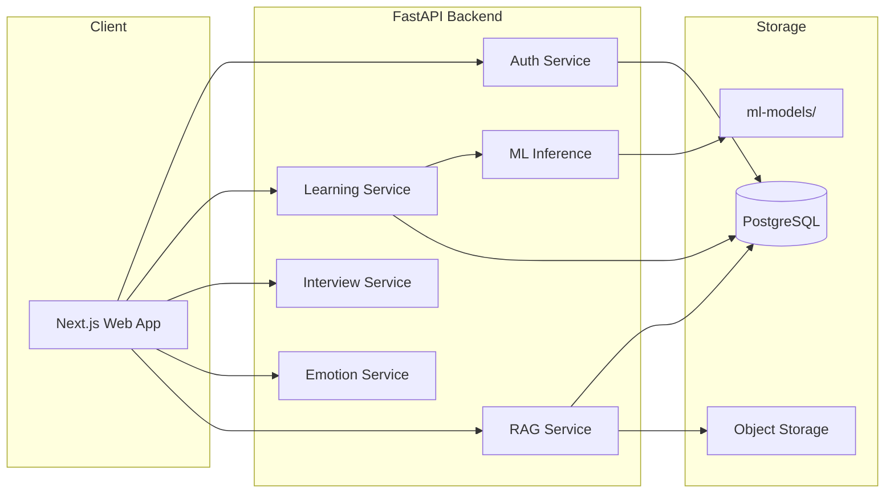

# MentorMind AI — System Architecture

## 1. High-Level Overview

MentorMind AI follows a **modular monolith** pattern: a Next.js frontend talks to a FastAPI backend. ML inference, RAG, and interview logic live in backend services. PostgreSQL (Supabase) stores users, progress, and metadata; vector embeddings use **pgvector** on the same database.



---

## 2. Core Services

### 2.1 Authentication (`/api/v1/auth`)

- JWT access + refresh tokens
- Signup, login, logout, password reset (future)
- User roles: `student`, `admin` (future)

### 2.2 Learning & Performance (`/api/v1/learning`)

- Submit quiz/assignment results
- Fetch performance predictions
- Study plan CRUD and weak-topic recommendations

### 2.3 Interview (`/api/v1/interview`)

- Session create/end
- Question generation (LLM)
- Answer submission (text + optional audio URL)
- Scoring: communication, technical, confidence aggregate

### 2.4 Emotion (`/api/v1/emotion`)

- WebSocket or chunked HTTP for frame analysis
- Returns: dominant emotion, confidence score, stress indicator

### 2.5 RAG (`/api/v1/rag`)

- PDF upload → chunk → embed → store in `document_chunks`
- Semantic search + LLM answer with citations

### 2.6 ML Inference (`/api/v1/ml`)

- `POST /predict/performance` — student outcome prediction
- `POST /predict/emotion` — batch image emotion (offline)
- Models loaded at startup from `ml-models/`

---

## 3. Database Schema (Summary)

| Table | Purpose |
|-------|---------|
| `users` | Account, profile, role |
| `user_progress` | XP, streaks, completed modules |
| `performance_records` | Scores, subjects, timestamps |
| `study_plans` | Generated plans per user |
| `study_plan_items` | Topics, priority, due dates |
| `interview_sessions` | Session metadata, scores |
| `interview_answers` | Q&A pairs per session |
| `documents` | Uploaded PDF metadata |
| `document_chunks` | Text chunks + embedding vector |
| `emotion_logs` | Optional session emotion snapshots |

Full SQL: [database/schema.sql](./database/schema.sql)

---

## 4. ML Pipeline

```
datasets/ → notebooks/ (EDA, training) → ml-models/ (artifacts)
                                              ↓
                                    FastAPI loads on startup
```

| Model | Algorithm | Input | Output |
|-------|-----------|-------|--------|
| Performance | XGBoost / LightGBM | Study hours, attendance, prior scores | Pass/risk level |
| Emotion | CNN / transfer learning (FER2013) | Face crop | 7 emotion classes |
| Recommendations | CF + rules | User history, weak topics | Ranked study items |

Training is **offline** in `notebooks/`; production serves **serialized** models only.

---

## 5. Security

- HTTPS everywhere in production
- JWT in `Authorization: Bearer`
- CORS restricted to frontend origin
- Row Level Security (RLS) on Supabase for direct client access (if used)
- Secrets via environment variables only

---

## 6. Deployment Topology

| Component | Platform |
|-----------|----------|
| Frontend | Vercel |
| Backend | Railway |
| Database | Supabase |
| ML artifacts | Bundled in backend image or object storage |

Docker Compose provided for local full-stack development.

---

## 7. API Versioning

All routes prefixed with `/api/v1`. Breaking changes increment version; v1 maintained during migration.
