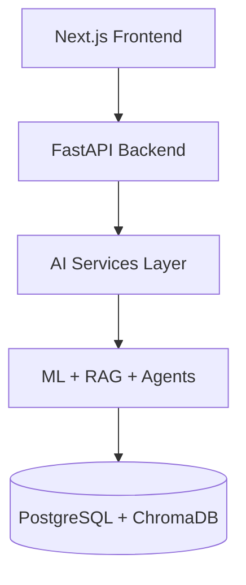

# Week 8 · Day 5 — Professional Documentation

Create recruiter-ready documentation: project overview, architecture, database, API examples, deployment, user guide, and developer guide.

---

## Documentation Deliverables

| Document | Description | Link |
|----------|-------------|------|
| **Project overview** | Objectives, features, tech stack | [PROJECT.md](./PROJECT.md) |
| **Architecture** | Layered system design | [architecture.md](./architecture.md) |
| **System diagram** | Full-stack Mermaid | [diagrams/system-architecture.mmd](./diagrams/system-architecture.mmd) |
| **AI pipeline diagram** | ML + RAG + Interview flows | [diagrams/ai-pipeline.mmd](./diagrams/ai-pipeline.mmd) |
| **Database schema** | Tables, ERD, relationships | [database-schema.md](./database-schema.md) |
| **SQL DDL** | PostgreSQL / Supabase script | [database/schema.sql](./database/schema.sql) |
| **API reference** | All endpoints + curl examples | [api-reference.md](./api-reference.md) |
| **Deployment guide** | Local → Docker → cloud | [deployment-guide.md](./deployment-guide.md) |
| **User guide** | How students use the app | [user-guide.md](./user-guide.md) |
| **Developer guide** | Contributor onboarding | [developer-guide.md](./developer-guide.md) |

---

## Architecture Diagrams

### System architecture



Full diagram: [diagrams/system-architecture.mmd](./diagrams/system-architecture.mmd)

### AI pipeline

Covers prediction, RAG, interview, and recommendation flows.

Full diagram: [diagrams/ai-pipeline.mmd](./diagrams/ai-pipeline.mmd)

---

## Core API Examples

Quick reference — full details in [api-reference.md](./api-reference.md).

### POST /api/predict

```bash
curl -X POST http://localhost:8000/api/predict \
  -H "Content-Type: application/json" \
  -d '{
    "study_hours": 6,
    "attendance": 88,
    "sleep_hours": 7,
    "prior_score": 72
  }'
```

### POST /api/recommend

```bash
curl -X POST http://localhost:8000/api/recommend \
  -H "Content-Type: application/json" \
  -d '{
    "subject_scores": [
      {"subject": "Mathematics", "score": 58},
      {"subject": "Programming", "score": 78}
    ],
    "include_study_plan": true
  }'
```

### POST /api/interview/start

```bash
curl -X POST http://localhost:8000/api/interview/start \
  -H "Content-Type: application/json" \
  -d '{"interview_type": "behavioral", "num_questions": 3}'
```

### POST /api/documents/chat

```bash
curl -X POST http://localhost:8000/api/documents/chat \
  -H "Content-Type: application/json" \
  -d '{
    "question": "What is recursion?",
    "document_id": "YOUR_DOC_ID",
    "top_k": 4
  }'
```

---

## Database Quick Reference

| Table | Relationship | Purpose |
|-------|--------------|---------|
| `users` | Root entity | Accounts, roles, gamification |
| `performance_data` | N → 1 users | Scores + ML predictions |
| `interview_results` | N → 1 users | Mock interview outcomes |
| `recommendations` | N → 1 users | Study recommendations |
| `refresh_tokens` | N → 1 users | JWT refresh token store |

ERD: [database-schema.md § Entity Relationship](./database-schema.md#2-entity-relationship-postgresql)

---

## Deployment (Summary)

1. **Supabase** — run `docs/database/schema.sql`
2. **Railway** — connect repo, set env from `.env.production.example`
3. **Vercel** — root `frontend/`, set `API_PROXY_URL`
4. **Verify** — `./scripts/check-deployment.sh`

Full steps: [deployment-guide.md](./deployment-guide.md)

---

## For Recruiters & Reviewers

Start here:

1. [PROJECT.md](./PROJECT.md) — what it does and why
2. [architecture.md](./architecture.md) — how it's built
3. [api-reference.md](./api-reference.md) — API surface
4. Live demo: `/coach`, `/assistant`, `/interview`

---

## Checklist

- [x] Project overview (objectives + features)
- [x] Architecture diagram (system + AI pipeline)
- [x] Database schema documentation
- [x] API docs with curl examples
- [x] Deployment guide
- [x] User guide
- [x] Developer guide
